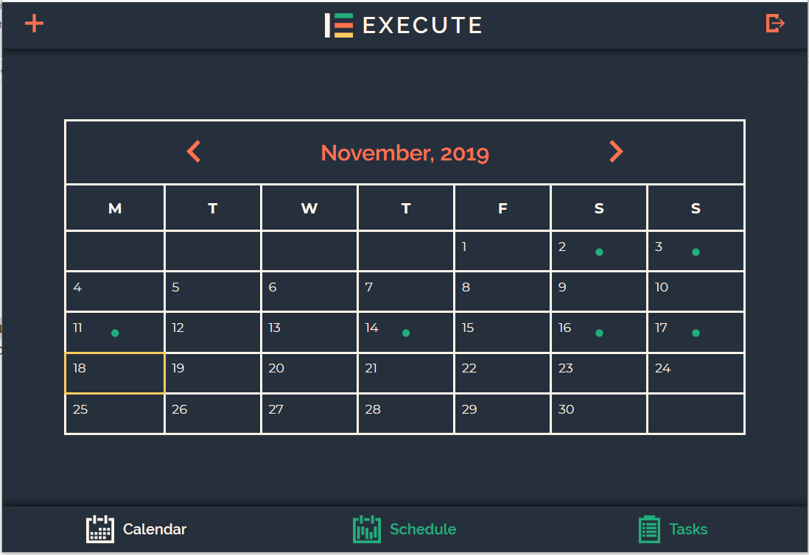
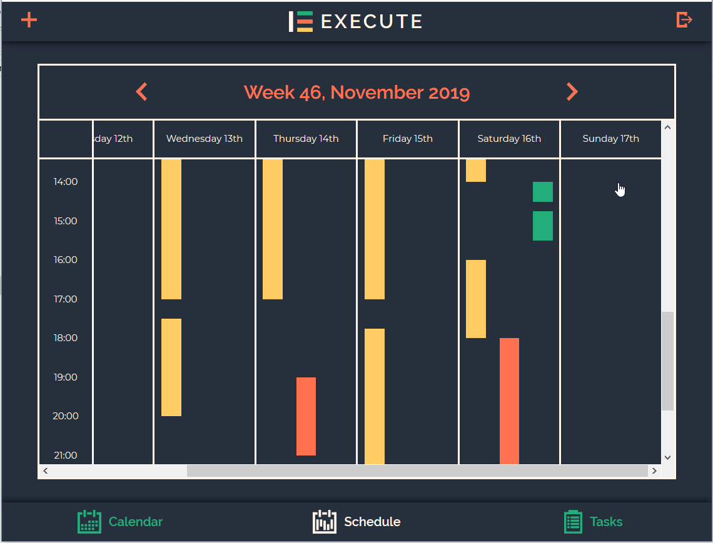
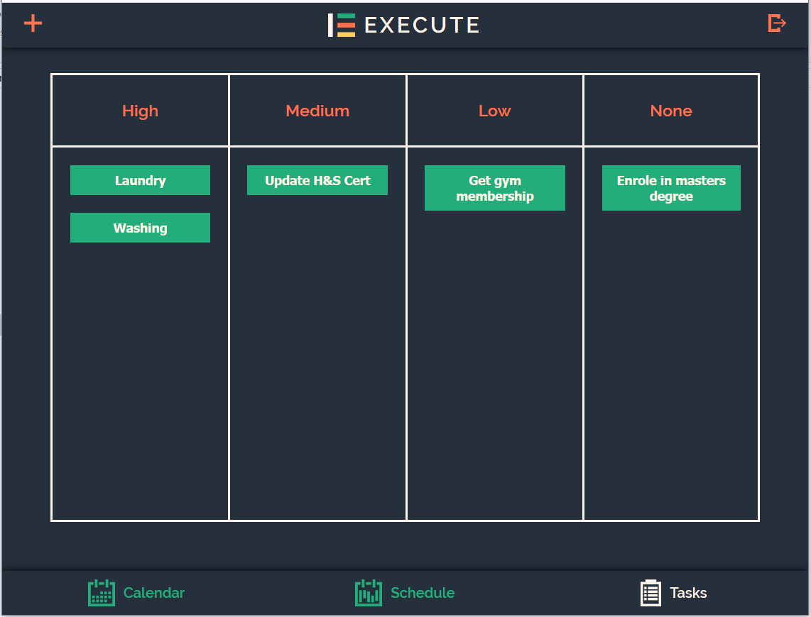
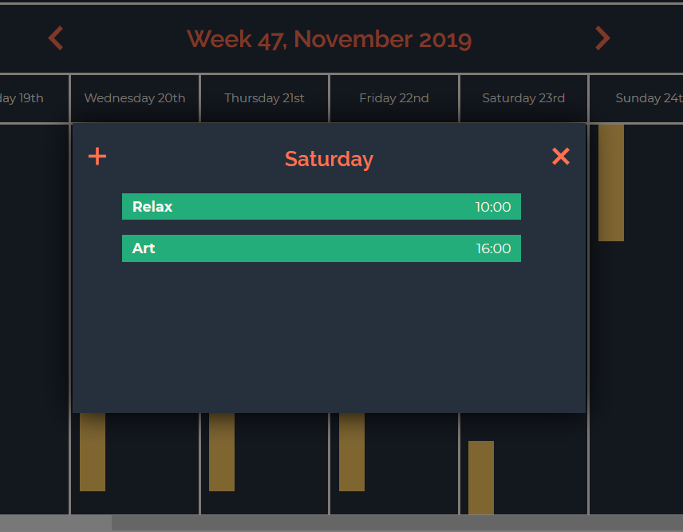
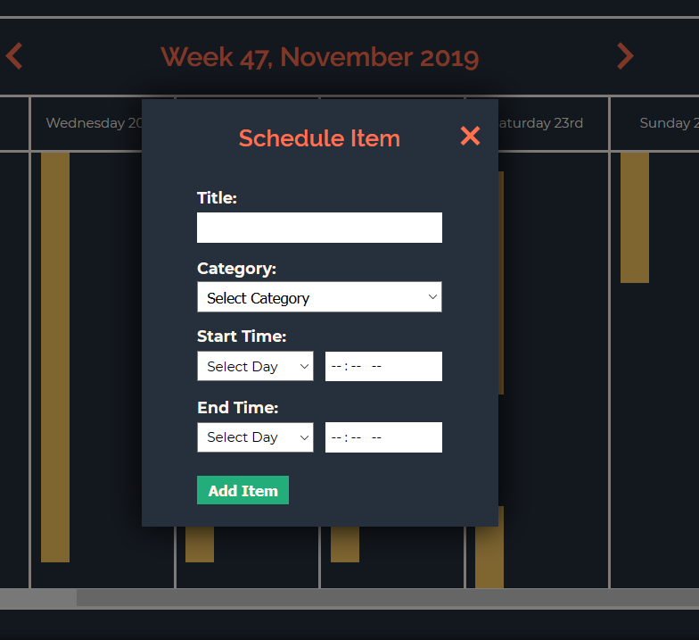

# Execute Web Application

View application on the web https://execute.netlify.com.

View code on GitHub https://github.com/jacksoncurrie/execute-web.

The frontend application repository for the Execute project. 

Testing documentation can be found in `src/tests/TESTING.md`, and application documentation can be found in `/src/APPLICATION.md`.

**Current Version:** 1.1

### Update Notes

#### Version 1.1

* Fix dates on boundries of weekly schedule.

#### Version 1.0

* First completed version of the frontend project.

## Launching Application

*Full list of commands can be found in `APPLICATION.md` documentation.*

#### initialize Application

**`npm i`**

**`npm run build`**

#### Open in Web Browser

**`npm start`**

#### Open on Desktop

**`npm run electron`**

#### Open in Android Studio

**`npx cap add android`**

**`npx cap open android`**

## Documentation

### Using Application

The application has the three modules at the bottom of the page to be used to navigate between them easily.

There is a common header with an add button, to add a new item to the current module. Their is also a sign out button, to sign the user out of this current instance.

### Calendar

* The buttons on either side of the month and year will go down and up one month respectively.
* By clicking on a day with a green dot, a list of items for that day will popup.
* By clicking on a day without a green dot, the add item popup will show to add a new item.
* The yellow highliged day is the current day.

### Schedule

* Bars are items tat span from the start of the bar to the end of it from the times on the left.

* Yellow bars are schedule items, orange are calendar items, and green are tasks. Which will show up on the days that are specified for.

* The bold day is the present day.

* Clicking on a day with scheudle items will open a list of schedule items for that day.

* Clicking on a day without schedule items will open an add new popup to add a new schedule item.

* The buttons on either side of the month and year will go down and up one week respectively.

### Tasks

* Each green box is a task within it's priority.

* By clicking on a task, it will open it to edit/add start date/deleting.

* Clicking on a priority title with some tasks will show a list of tasks for that priority.

* Clicking on a priority title without some tasks will bring up an add new popup.

### Item List

* This will list all of the items for the specified module section (e.g. Saturday scheduled items).

* Clicking on an item will open it for editing/deleting.

* Clicking the add button will add a new item with a back button to this list.

* Clicking the cross will close the list and go back to the program.

### Add Item

* Each module has it's own add item popup form.

* Each field needs to be filled to add/edit and item.

* An item should automatically be added to the main application once added.

* A delete button will appear if opening an item for edit, and this is how it can be deleted.

* Input fields are using native web inputs, so different popups may occur depending on browser/device.
