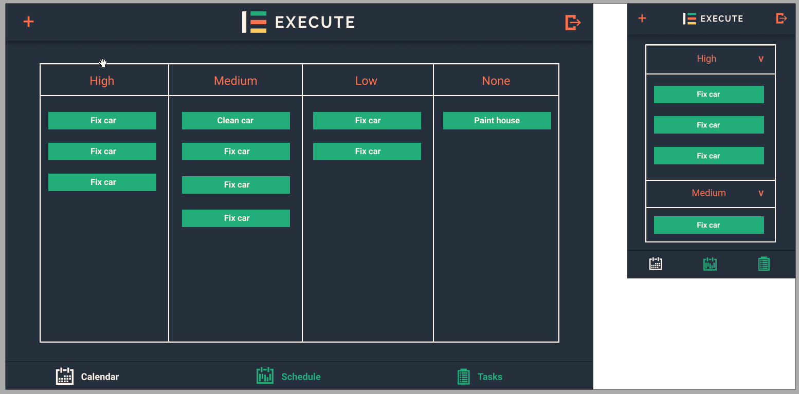

# Application Development Documentation

This documentation file contains information about the location and functions of the files in the Execute Website project.

## Main Entry

**index.jsx** is the main entry for the Web application. This file adds all the components to the web page.

The service worker (`serviceWorker.unregister()`) can be registered for the application to work offline better. At the moment all the data comes from an online API, so it is currently unregistered.

**electronStart.js** is the main entry for the Electron application. This file configures and creates the electron window.

### Commands

1. **`npm i`** will install all the dependencies for the application, and needs to be run before any other command.

2. **`npm start`** will crate a development server in the browser to help debug the application during development.

3. **`npm run build`** will create an optimised build of the web app and placed into the `/build` folder.

4. **`npm test`** will run all the tests in the `/test` folder (any file with `.test.js`) to automated some of the testing of the components.

5. **`npm run electron-dev`** will need to be run alongside `npm start` to add the development web server into an Electron window.

6. **`npm run electron`** will run the optimised web app (`/build` folder) in an Electron window.

7. **`npx cap add android`** will add an android project into `/android` from the configuration set in `../capacitor.config.json`.

8. **`npx cap open android`** will open the android project created above in Android Studio, which will be compiled and be able to be run in an emulator or on a device.

## Components

All components are in the `/components` folder. Each component is in it's own JSX file.

Each component is using a `class` with a `state` and the common event methods (e.g. `componentDidMount()`). Some of the components will have `props` which come through from the parent components. 

The main parent component in `App.jsx` which includes all the components and defines their props. This file also contains all the logic for connecting to the GraphQL API, and therfore in charge of getting the data to the components. 

### Application Logic

The application is connected to an database hosted online. This is configured at the top of the `applicationLogic.js` file. This file also contains all the queries and mutations to connect to the GraphQL API. These functions can be accessed to get data from and send data to the database.

## Electron (Desktop)

The Desktop application uses Electron to host the web application in cross platform desktop windows. The app should be published using electron publisher, so that it is optimised for each operating system.

The Electron applciation is configured in `electronStart.js` which will create the browser window to host the web application. Other than hosting the application all the other logic is native to the web, so no other configuration is required.

## Capacitor (Mobile)

The Mobile application uses Ionic and Capacitor to host the native web application in a mobile application. The app will therefore be cross platform and consistent across devices and needs to be published using the apacitor commands shown above.

The capacitor configuration is in `capacitor.config.json` which has various settings for the application. The web director is important to be `/build` as this is where the optimised application lives.

## Design Plans

The initial designs of the application to base the styling of the page.

### Calendar

The calendar needs to be simple and show which days have items on them, and what the current month and year is.

### Schedule

The shceulde needs to show what week, month and year it is on, and have all the schedule itmes, calendar items and tasks on their respective days.

### Tasks

There should be tasks listed in their specified priorities, which ca nbe easliy updated and added to a day to be completed.

### Popups

There should be easy to use forms to enter data for adding, editing, etc.

