# Testing Documentation

This contains the regression testing for the Execute Frontend project

## Automated Tests

All automated tests can be found in this `/tests` folder.

To execute the tests run `npm run test`.

### React Component Automation Tests

#### Test Plan

1. All components in the application mount to the main app with valid test data.

#### Test Results - Version 1.1

1. All the components in the application mounted to the main app with valid test data. 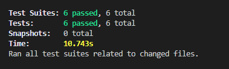

## Manual Tests

Manual tests are run to make sure the application functions and looks as anticipated.

### Application Logic

#### Test Plan

1. Logging in with *jackson* account should allow access to the application.
2. Logging out should bring up login popup and no access to the application.
3. Adding a new calendar item should add it to calendar component.
4. Updating a calendar item should update it on calendar component.
5. Removing a calendar item should remove it from the calendar component.
6. Adding a new schedule item should add it to scheudle component.
7. Updating a scheudle item should update it on schedule component.
8. Removing a schedule item should remove it from the schedule component.
9. Adding a new task should add it to the tasks list component.
10. Updating a tasks should update it on the tasks list component.
11. Removing a task should remove it from the tasks list component.

#### Test Results - Version 1.1

1. Logging in with *jackson* account allows access to the application.
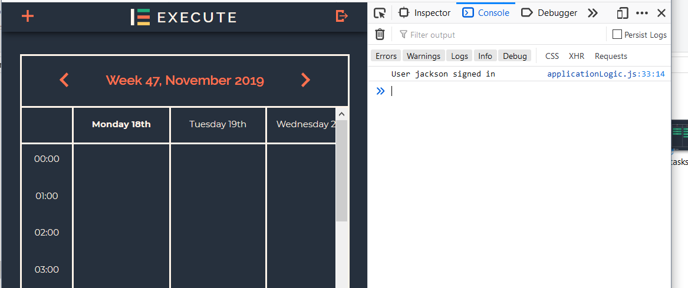
2. Logging out brings up login popup and has no access to the applicaiton.
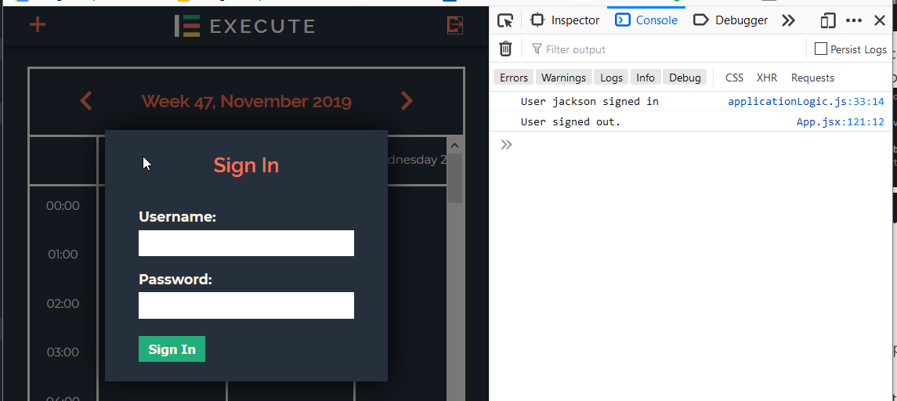
3. Adding a new calendar item successfully added it to calendar component.
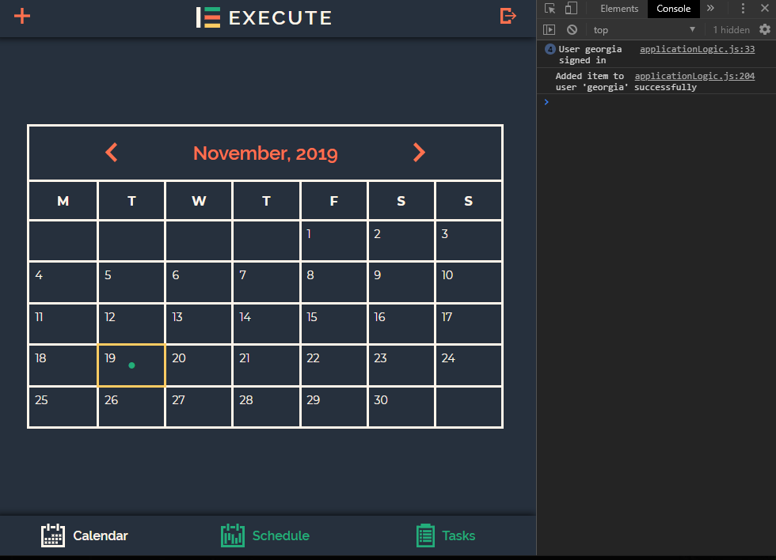
4. Updating a calendar item successfully updated it on calendar component.
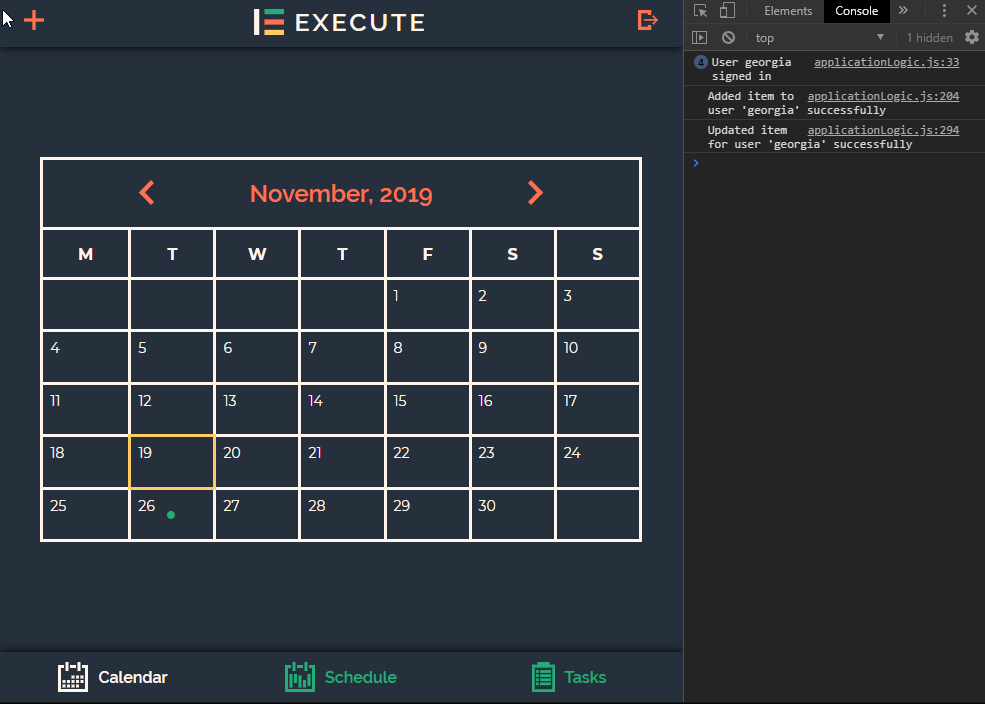
5. Removing a calendar item successfully removed it from the calendar component.
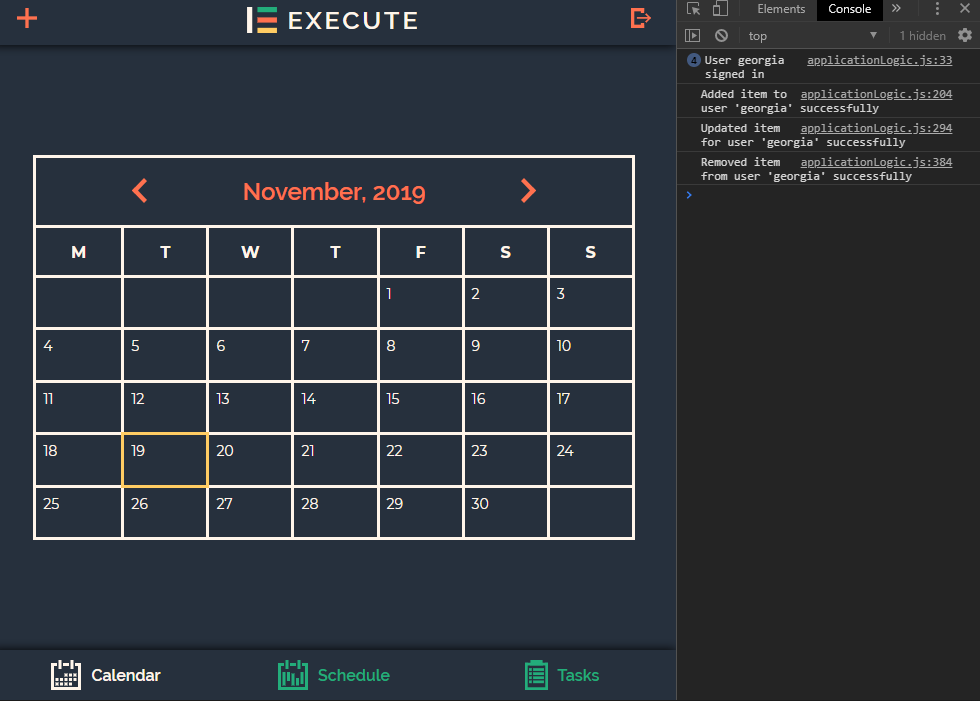
6. Adding a new schedule item successfully added it to scheudle component.
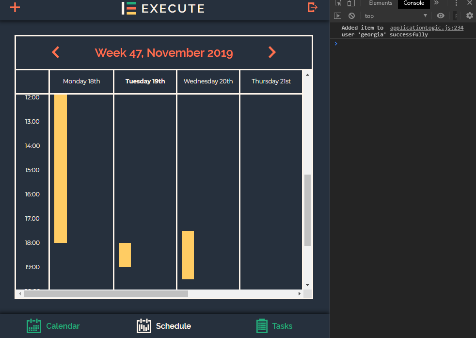
7. Updating a scheudle item successfully updated it on schedule component.
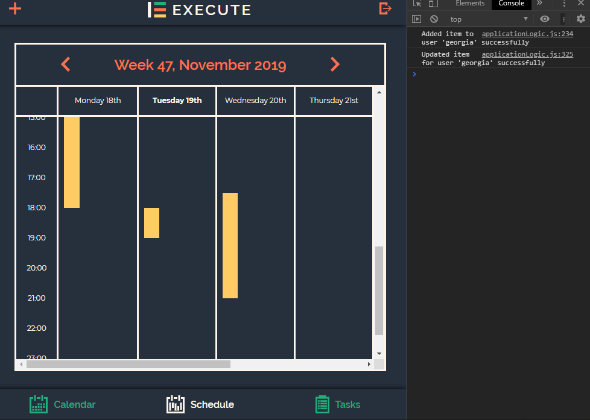
8. Removing a schedule item successfully removed it from the schedule component.
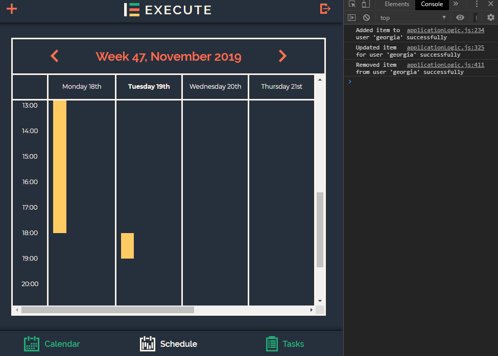
9. Adding a new task successfully added it to the tasks list component.
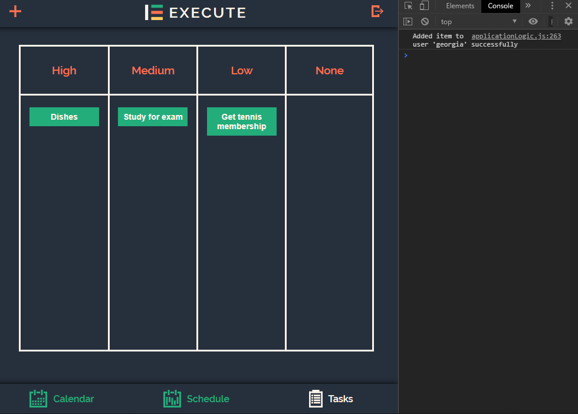
10. Updating a tasks successfully updated it on the tasks list component.
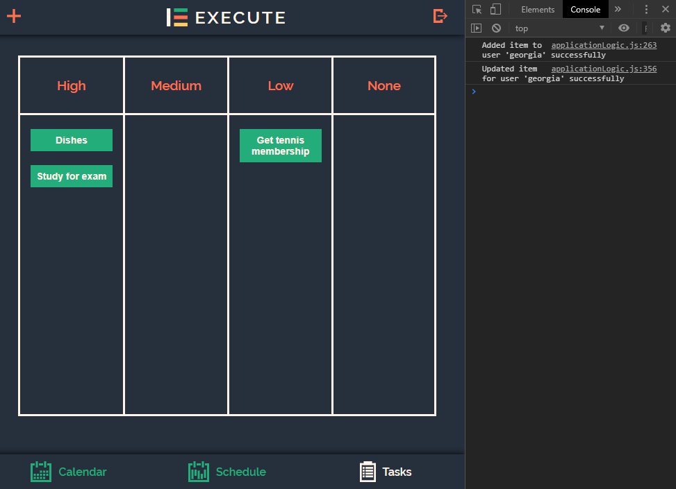
11. Removing a task successfully removed it from the tasks list component.
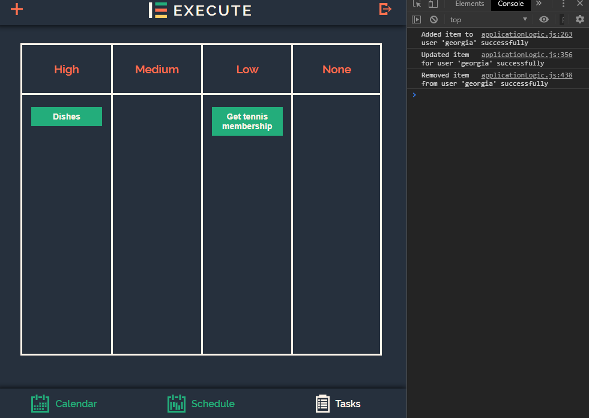

### Design

#### Test Plan

1. Popups should look as designed, and have no issues with positioning/colouring.
2. Calendar should look as designed, and have no issues with positioning/colouring.
3. Schedule should look as designed, and have no issues with positioning/colouring.
4. Tasks should look as designed, and have no issues with positioning/colouring.

#### Test Results - Version 1.1

1. Popups do look as designed, and have no issues with positioning/colouring.
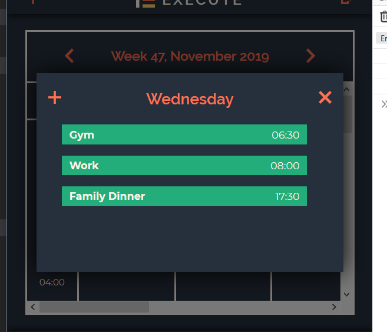
2. The calendar does look as designed, and has no issues with positioning/colouring.
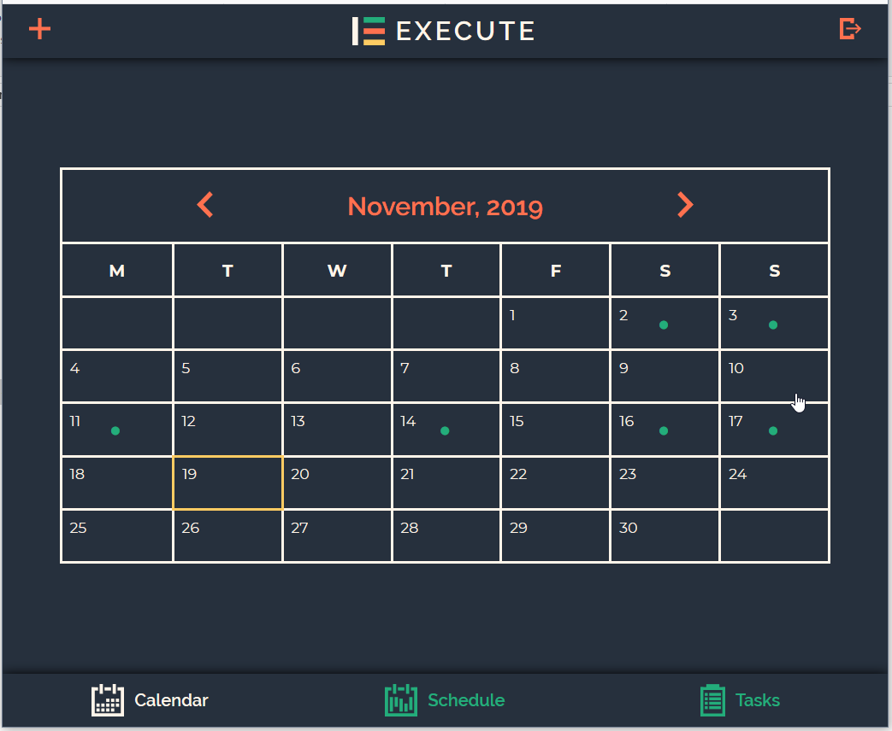
3. The schedule does look as designed, and has no issues with positioning/colouring.
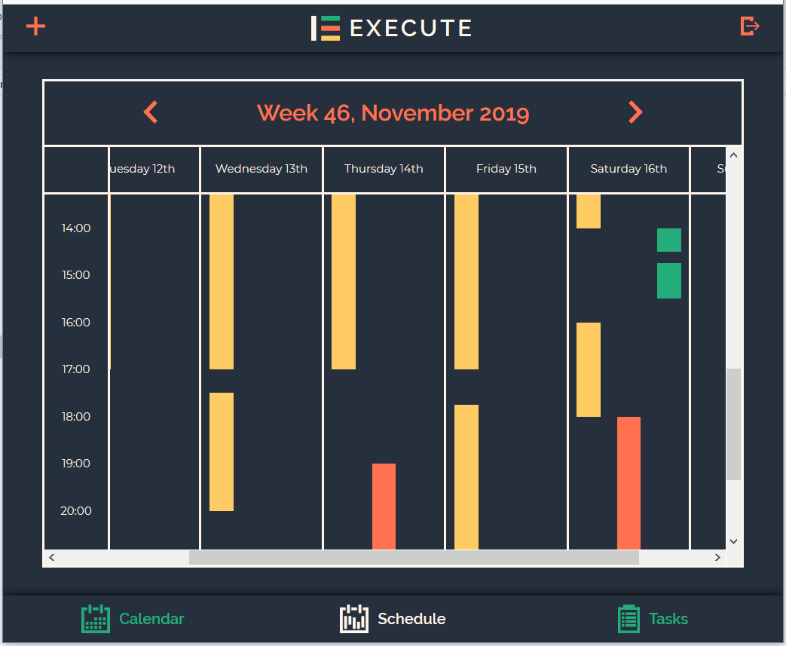
4. The tasks list does look as designed, and has no issues with positioning/colouring.
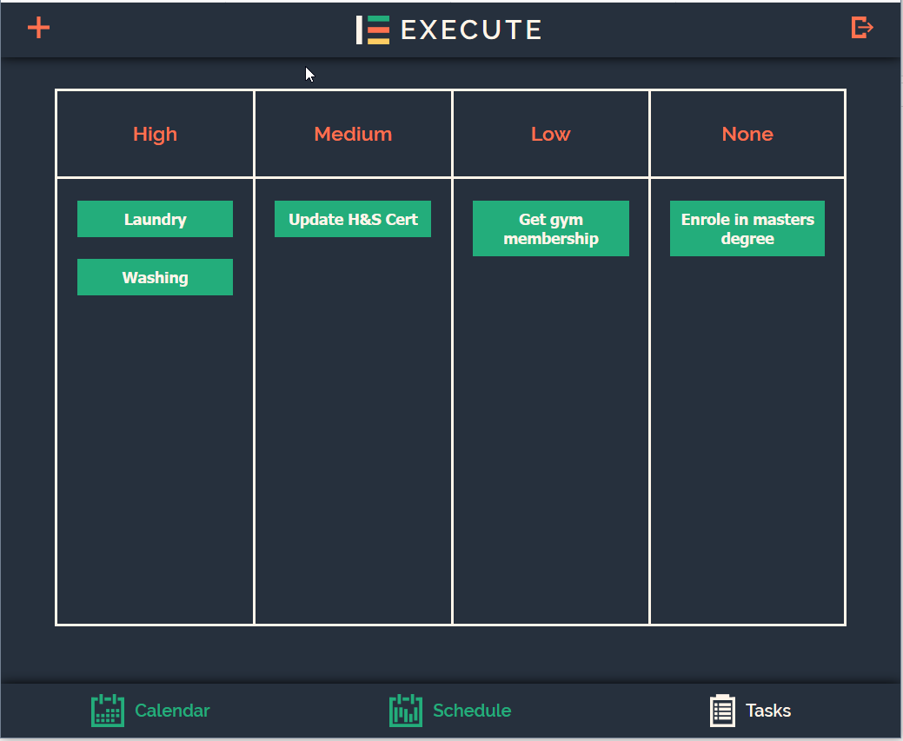
